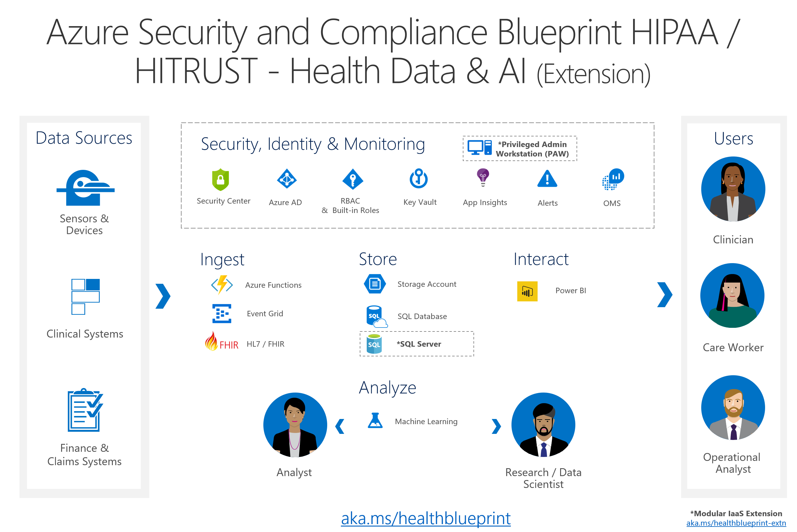
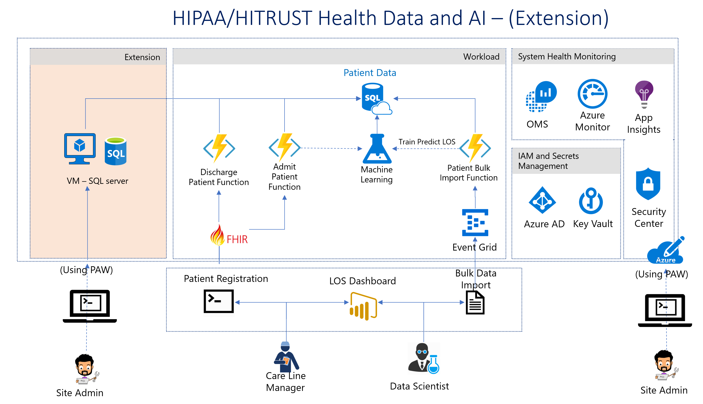

---
title: HIPAA/HITRUST Health Data and AI - Extension PREVIEW
description: Guidance for deploying the on premise host, and PAW for the Health Data & AI Blueprint
author: Simorjay 
ms.date: 07/12/2018
---

# Azure HIPAA/HITRUST Health Data and AI - Extension (PREVIEW)

The HIPAA/HITRUST Health Data and AI - Extension provides customers the ability to deploy the health blueprint to include a hybrid IaaS deployment to understand how Azure Security Center and other 
security technologies such as end point host protection would work in the Healthcare solution.
This solution will help expose the effort to migrate an on-premise SQL based solution to Azure, and to implment a Privileged Access Workstation (PAW) to securely manage all cloud based services and solutions.

What makes this health data and AI - extention unique is that it covers the extensions of the PaaS Health-Data-and-AI-Blueprint, demonstraing best practice and possible approaches to address the following new points:

1.	Extend the existing PaaS sample to show secure co-existence between PaaS and IaaS VM workload elements.
2.	“Start Secure” – enable security capabilities and monitoring of the IaaS VM workload before any sensitive data or workload processing takes place.
3.	Illustrate how to use recently introduced security and deployment capabilities.

The deployment of the IaaS VM includes usage of Azure Security Center, network security group and network access lockdown, auto-update capability for patch management, usage of encryption at rest capabilities, usage of eventlog audit log collection and monitoring capabilities, usage of managed service identity, automated encrypted backup capabilities, and more.

This blueprint extension will extend the current Health blueprint to:

**INGEST** data including FHIR data source

**STORE** sensitive and reglulated health information (in both a Windows SQL2017 server, and Azure PaaS solution)

**ANALYZE** and predict outcomes (using an existing Machine Learning solution)

**INTERACT** with the results and preditions (using an existing PowerBi solution)

**IDENTITY** management of solution (Azure Active Directory and role-based access control (RBAC))

**SECURITY** enabled features (Including Azure Security Center,Operations Management Suite (OMS), and Application Insights
)

# Deploying the solution overview

## Setting up a Privileged Access Workstation (PAW) ##

It is essential that before any deployment is started a known 'good client' is configured to connect to the cloud. This can be done in varied levels of security assurance. Ideally it is recommended that a **Privileged Access Workstation** be set up and all administrators operate in the constraints of the secured client model.

Deploy a PAW solution to ensure that management of the services is done in a secure service model. 
This step is recommended to ensure that no access be done to subscription management without a isolated client host. 
Review [Privileged Access Workstation (PAW) for details.](https://docs.microsoft.com/en-us/windows-server/identity/securing-privileged-access/privileged-access-workstations)

## Setting up Pre-Requisites and enabling services ##

The Deploy the Health data and AI - Extension solution will require the configuration and set up including the configuration of a known good client install host, and service rights to deploy the components. This can be found in the Run **deploy.ps1** with the **installModules** switch to install and verify all components are correctly set up of the [deployment guide](./deployment.md).

## Setting up the PaaS based health data and AI solution ##

Deploy the [Azure Security and Compliance Data and AI Health Blueprint](https://github.com/Azure/Azure-Health-Extension) will install the core elements of the PaaS solution. This includes all of the platform-as-a-service (PaaS) environment for ingesting, storing, analyzing, and interacting with personal and non-personal medical records in a secure, multi-tier cloud environment, deployed as an end-to-end solution. It showcases a common reference architecture and is designed to simplify adoption of Microsoft Azure.
Details to the original solution can be found at the [Azure Security and Compliance Blueprint - HIPAA/HITRUST Health Data and AI](https://docs.microsoft.com/en-us/azure/security/blueprints/azure-health) resource.

## Deploy the IaaS lockdown configurations ##
In this step use of the deployIaaS.ps1 script found in the [Blueprint/Deployment](./Deployment) folder, will Deploy the Health data and AI (Extension). The script will enable the following capabilities
in three Phases:

### Phase 1:  Initial deployment and setup. ###
1.	Turns on ASC auto-provisioning for all IaaS VMs in subscription.
2.	Sets up AAD application ID and service principal, for key vault authentication.
3.	Enables ASC and OMS monitoring at resource group level (new APIs).
4.	Deploys latest SQL2017 instance running on windows 2016.
5.	Sets up VM admin account using strong random password and username.
6.	Sets up VM with zero exposed inbound internet access, via network security group configuration.
7.	Configures OMS workspace elements for VM monitoring.
8.	Enables mandatory storage encryption and https usage for all used storage accounts.  SQL backup and provisioning artifacts accounts use VNET firewall rules, and SAS token access for provisioning artifacts, to block access to these assets from unauthorized systems or from the internet.
9.	Configures two Azure KeyVault instances with HSM and soft-delete capability, one instance used by SQL, and one instance used by Azure Disk Encryption, using separate access policies.
### Phase 2:  Applying security policies and monitoring capabilities. ###
1.	Enables Azure disk encryption, using new deployment model that doesn’t require dedicated Application ID and service principal provisioning.
2.	Enables and configures Microsoft Anti-malware.
3.	Enables Microsoft monitoring agent, for VM eventlog and security audit log collection and retention in Azure storage account.
4.	Enables SqlIaaS extension: scheduled maintenance & patching window, Azure keyvault integration for TDE, and automated encrypted backup support.
5.	Enables SQL AD based administration of existing PaaS database instance.
6.	Network security group and subnet access used to lockdown access between SQL IaaS VM and PaaS SQL instance.
7.	Uses managed service identity, for Sql IaaS VM -> SQL PaaS authentication.
### Phase 3: Deploying and executing payload to deployed VM. ###
1.	Customscript extension execution illustrates “lift and shift” of on-premise exported data to the SQL IaaS VM instance, without opening internet facing ports.
2.	Sample health data set is deployed to the IaaS VM and imported into the SQL instance.
3.	IaaS VM to PaaS SQL database query is issued, using Virtual Machine managed service identity authentication.  
NOTE - The VM will be isolated to an Azure Vnet. To gain access to the IaaS VM, you will require to add and a local inbound port rule to allow 3389 for rdp connection to the VM
 address. Additional the VM's password will require to be rereset. 
 
 
 

## INTERACT (Data visualization) using PowerBi reflects the last step of the demonstration. ##

The script upon completing will move 10,000 new patient records that have been loaded into the SQL2017 server from the VM, to the Azure SQL server illustrating the automated effort in moving data from a VM that was a result of a "Lift and Shift" operation, to a pure PaaS operation in Azure.

 View revised data in PowerBi (PowerBI dashboard will be updated)
The solution provides a simple Microsoft PowerBI visualization of the solution. Microsoft PowerBI is required to open the sample report located (Using PowerBi free edition works for this demo, but will not allow for reports to be shared) [Blueprint/Deployment/Reports](https://github.com/Azure/Azure-Health-Extension) 

# Deploying the solution 

**[Solution Overview](./readme.md)** 

 (with IaaS extention)

**[FAQ](./faq.md)** 

**[files/Azure_Security_and_Compliance_Blueprint_HIPAAHITRUST_Health_Data_AI-ThreatModel_with_IaaS_Extention.tm7](https://github.com/Azure/Azure-Health-Extension) **

**[files/HITRUST_Health_Data_and_AI_extention_Customer_Responsibility_Matrix_CRM_v9.xlsx](https://github.com/Azure/Azure-Health-Extension) **

# Disclaimer

 The deployment script is designed to deploy the core elements of the Azure Security and Compliance Blueprint - HIPAA/HITRUST Health Data and AI. The details of the solutions operation, and elements can be reviewed at aka.ms/healthcareblueprint
Copyright (c) Microsoft Corporation, and KenSci - All rights reserved.
Permission is hereby granted, free of charge, to any person obtaining a copy of this software and associated documentation files (the "Software"), to deal in the Software without restriction, including without limitation the rights  to use, copy, modify, merge, publish, distribute, sublicense, and/or sell copies of the Software, and to permit persons to whom the Software is  furnished to do so, subject to the following conditions:
The above copyright notice and this permission notice shall be included in all copies or substantial portions of the Software.
THE SOFTWARE IS PROVIDED "AS IS", WITHOUT WARRANTY OF ANY KIND, EXPRESS OR IMPLIED, INCLUDING BUT NOT LIMITED TO THE WARRANTIES OF MERCHANTABILITY,  FITNESS FOR A PARTICULAR PURPOSE AND ONINFRINGEMENT. IN NO EVENT SHALL THE AUTHORS OR COPYRIGHT HOLDERS BE LIABLE FOR ANY CLAIM, DAMAGES OR OTHER LIABILITY, WHETHER IN AN ACTION OF CONTRACT, TORT OR OTHERWISE, ARISING FROM, OUT OF OR IN CONNECTION WITH THE SOFTWARE OR THE USE OR OTHER DEALINGS IN THE SOFTWARE.

